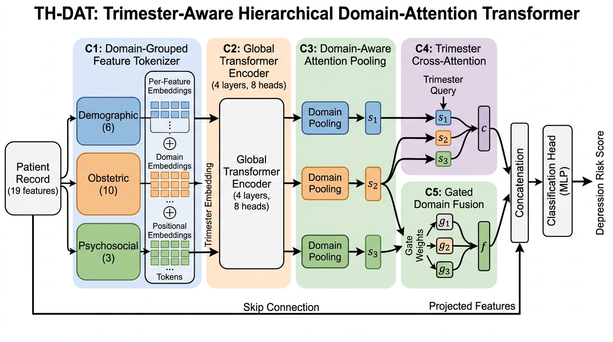

# TH-DAT: Trimester-Aware Hierarchical Domain-Attention Transformer for Antenatal Depression Prediction

[](https://www.python.org/downloads/)
[](https://pytorch.org/)
[](https://opensource.org/licenses/MIT)

## Overview

TH-DAT is a novel deep learning architecture for predicting antenatal depression from routinely collected clinical data. It introduces:

1. **Domain-Grouped Feature Tokenization** — partitions clinical features into Demographic, Obstetric, and Psychosocial domains
2. **Global Transformer Encoder** — enables cross-domain feature interactions via multi-head self-attention (L=4, H=8)
3. **Trimester Cross-Attention** — conditions predictions on pregnancy stage (T1/T2/T3)
4. **Gated Domain Fusion** — produces per-patient interpretable domain contribution weights with entropy regularization
5. **Two-Phase Training** — masked pretraining + focal-contrastive fine-tuning with SMOTE oversampling

## Results

| Rank | Model | AUC-ROC | Accuracy | F1 |
|:---:|---|:---:|:---:|:---:|
| 1 | **TH-DAT (Ours)** | **0.9769** | **0.9321** | **0.9314** |
| 2 | Random Forest | 0.9670 | 0.9247 | 0.9246 |
| 3 | TabTransformer | 0.9527 | 0.8946 | 0.8942 |
| 4 | XGBoost | 0.9072 | 0.8139 | 0.8170 |
| 5 | Autoencoder | 0.8898 | 0.8194 | 0.8187 |
| 6 | FT-Transformer | 0.8568 | 0.7669 | 0.7768 |
| 7 | SAINT | 0.8543 | 0.7614 | 0.7598 |
| 8 | ANN | 0.8514 | 0.7735 | 0.7579 |
| 9 | GPT-2 | 0.6797 | 0.6342 | 0.6940 |
| 10 | BERT | 0.6760 | 0.5899 | 0.6031 |
| 11 | RoBERTa | 0.6469 | 0.5852 | 0.6311 |
| 12 | T5 | 0.5631 | 0.5514 | 0.6226 |

### Cross-Dataset Validation (Uganda EPDS)
TH-DAT achieves **0.9610 AUC-ROC** on the independent Uganda EPDS dataset (N=14,325), providing preliminary evidence of transportability across cohorts.

## Datasets

| Dataset | Records | Features | Prevalence | Source |
|---|:---:|:---:|:---:|---|
| PERI_DEP (Pakistan) | 14,008 | 19 | 35.2% | [Zenodo](https://zenodo.org/records/11403247) |
| Uganda EPDS | 14,325 | 13 | 23.0% | [Mendeley Data](https://data.mendeley.com/datasets/4swmy34scp/3) |

## Repository Structure

```
TH-DAT/
├── README.md
├── paper/
│   └── TH-DAT_Research_Paper.pdf    # Full manuscript (23 pages)
├── code/
│   ├── 01_preprocessing_perideep.py  # Data loading, SMOTE, splits
│   ├── 02_baselines.py              # RF, XGBoost, ANN, Autoencoder
│   ├── 03_tab_transformers.py       # TabTransformer, FT-Transformer
│   ├── 03b_saint.py                 # SAINT model
│   ├── 04_text_transformers.py      # BERT, GPT-2, RoBERTa, T5
│   ├── 05_th_dat.py                 # Proposed TH-DAT architecture
│   ├── 06_ablation.py               # 6-configuration ablation study
│   ├── 07_plots.py                  # All publication plots
│   └── 08_uganda_validation.py      # Uganda external validation
└── plots/
    └── thdat_architecture.jpg       # Architecture diagram
```

## Quick Start (Google Colab)

```python
# 1. Upload dataset.csv to /content/drive/MyDrive/
# 2. Run scripts in order:

!python 01_preprocessing_perideep.py   # Saves .npy files
!python 02_baselines.py               # RF, XGBoost, ANN, Autoencoder
!python 03_tab_transformers.py        # TabTransformer, FT-Transformer
!python 03b_saint.py                  # SAINT
!python 04_text_transformers.py       # BERT, GPT-2, RoBERTa, T5
!python 05_th_dat.py                  # TH-DAT (proposed)
!python 06_ablation.py               # Ablation study
!python 07_plots.py                   # Generate all figures
!python 08_uganda_validation.py       # Uganda cross-dataset validation
```

## Requirements

- Python 3.12+
- PyTorch 2.5.1 (CUDA 12.4)
- scikit-learn 1.6.1
- XGBoost 2.1.3
- Hugging Face Transformers 4.48.3
- imbalanced-learn 0.12.4
- NVIDIA Tesla T4 GPU (16 GB VRAM) — Google Colab recommended

## Architecture



## Authors

- **Saivenkat H**, Lavanya, Adithya, Shapper
- **Guides:** Dr. Beebi Naseeba, Dr. Rishitha Muddana
- School of Computer Science and Engineering, VIT-AP University, Amaravati, AP, India
- Contact: hsaivenkat1@gmail.com

## Citation

```bibtex
@article{saivenkat2026thdat,
  title={TH-DAT: Trimester-Aware Hierarchical Domain-Attention Transformer for Antenatal Depression Prediction},
  author={Saivenkat, H. and Lavanya and Adithya and Shapper and Naseeba, Beebi and Muddana, Rishitha},
  year={2026},
  institution={VIT-AP University}
}
```

## License

This project is licensed under the MIT License.
